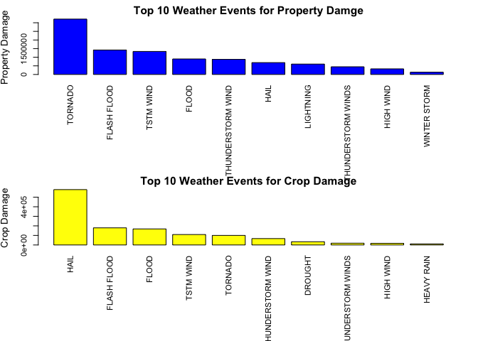

#### Lyn Yang
#### May 21, 2023

## Title:Analysis on weather's effects on health and economic consequences
## Synopsis: This data analysis synthesizes weather's effects on health and economic consequences and uses bar charts to display the effects of weather. Based on the current analysis, we can tell that tornado is the most harmful weather to population health. Tornado and hail are the weather that leads to the most severe economic consequences.

### Data Processing:
#### Loading the data:

```r
        url <- "https://d396qusza40orc.cloudfront.net/repdata%2Fdata%2FStormData.csv.bz2"
        download.file(url, destfile = "Data.csv.bz2", method = "curl")
        NOAA <- read.csv(bzfile("Data.csv.bz2"), header = TRUE, 
                         stringsAsFactors = FALSE)
```

#### Loading some R packages

```r
        library(dplyr)
```

```
## 
## Attaching package: 'dplyr'
```

```
## The following objects are masked from 'package:stats':
## 
##     filter, lag
```

```
## The following objects are masked from 'package:base':
## 
##     intersect, setdiff, setequal, union
```

### Results
#### Across the United States, which types of events are most harmful with respect to population health?

##### Based on the dataset description, we can tell that there are two variables relate to being harmful to the population health. They are the fatalities number and the injuries number. So we'll take a look at them.

##### Total Fatalities

```r
        Total_Fatalities <- aggregate(NOAA$FATALITIES, by = list(NOAA$EVTYPE),
                                      "sum", na.rm = TRUE)
        names(Total_Fatalities) <- c("Event", "Total Fatalities")
        Total_Fatalities_sorted <- Total_Fatalities[order(-Total_Fatalities$`Total Fatalities`), ][1:10, ]
```

##### Total Injuries

```r
        Total_Injuries <- aggregate(NOAA$INJURIES, by = list(NOAA$EVTYPE),
                                      "sum", na.rm = TRUE)
        names(Total_Injuries) <- c("Event", "Total Injuries")
        Total_Injuries_sorted <- Total_Injuries[order(-Total_Injuries$`Total Injuries`), ][1:10, ]
```

##### Visualization

```r
        par(mfrow = c(2, 1), mar = c(10, 4, 2, 2), las = 3, cex = 0.7, 
            cex.main = 1.4, cex.lab = 1.2)
        barplot(Total_Fatalities_sorted$`Total Fatalities`, 
                names.arg = Total_Fatalities_sorted$Event, col = 'black', 
                main = 'Top 10 Weather Events for Fatalities', ylab = 'Fatalities Number')
        barplot(Total_Injuries_sorted$`Total Injuries`, 
                names.arg = Total_Injuries_sorted$Event, col = "grey", 
                main = 'Top 10 Weather Events for Injuries', ylab = 'Injuries Number')
```

<!-- -->

#### Across the United States, which types of events have the greatest economic consequences?

##### We can tell from the description that there're two varaibles show the economic consequences, which are the property damage and the crop damage. So we'll take a look at them.

##### Total Property Damage

```r
        Total_PDMG <- aggregate(NOAA$PROPDMG, by = list(NOAA$EVTYPE),
                                      "sum", na.rm = TRUE)
        names(Total_PDMG) <- c("Event", "Total Property Damage")
        Total_PDMG_sorted <- Total_PDMG[order(-Total_PDMG$`Total Property Damage`), ][1:10, ]
```

##### Total Crop Damage

```r
        Total_CDMG <- aggregate(NOAA$CROPDMG, by = list(NOAA$EVTYPE),
                                      "sum", na.rm = TRUE)
        names(Total_CDMG) <- c("Event", "Total Crop Damage")
        Total_CDMG_sorted <- Total_CDMG[order(-Total_CDMG$`Total Crop Damage`), ][1:10, ]
```

##### Visualization

```r
        par(mfrow = c(2, 1), mar = c(10, 4, 2, 2), las = 3, cex = 0.7, 
            cex.main = 1.4, cex.lab = 1.2)
        barplot(Total_PDMG_sorted$`Total Property Damage`, 
                names.arg = Total_PDMG_sorted$Event, col = 'blue', 
                main = 'Top 10 Weather Events for Property Damge', 
                ylab = 'Property Damage')
        barplot(Total_CDMG_sorted$`Total Crop Damage`, 
                names.arg = Total_CDMG_sorted$Event, col = "yellow", 
                main = 'Top 10 Weather Events for Crop Damage', 
                ylab = 'Crop Damage')
```

<!-- -->


